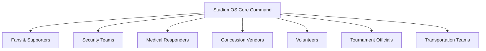
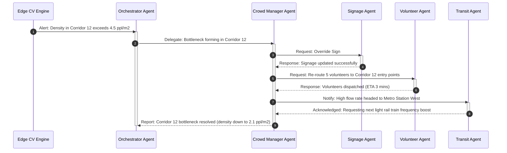

# Product Requirement Document (PRD)
## Project Name: StadiumOS
### Tagline: Predict. Decide. Act.
**Version:** 1.0.0  
**Author:** AI Solutions Architect & Principal Product Manager, Google Cloud  
**Status:** Draft for Executive Review  

---

## 1. Executive Summary

Traditional stadium management during global mega-events like the FIFA World Cup is inherently siloed and reactive. Operations centers rely on fragmented CCTV feeds, manual radio chatter, disparate vendor inventories, and independent transit agencies. This lack of coordination leads to localized crowd crushing, delayed emergency medical response, supply chain bottlenecks, high staff fatigue, and sub-optimal attendee experiences.

**StadiumOS** is an AI-native, multi-agent operating system designed specifically for the FIFA World Cup 2026. By synthesizing multi-modal signals—including edge-processed CCTV streams, turnstile IoT data, concessions POS telemetry, match scheduling, regional transit APIs, and official stadium handbooks—StadiumOS acts as a unified digital nervous system. 

The platform leverages:
*   **Edge Computer Vision (CV)** for anonymized crowd dynamics, queue counting, and hazard detection.
*   **Machine Learning (ML)** for predictive analytics (concessions demand, transit bottlenecks, turnstile queue times).
*   **Generative AI (GenAI)** for complex cognitive reasoning, semantic search over official SOP documents (via RAG), and automated drafting of incident reports.
*   **Multi-Agent Orchestration** to autonomously dispatch resources, route pedestrian crowds, re-allocate volunteer shifts, and alert first responders.

By shifting stadium operations from a model of *reactive containment* to *proactive orchestration*, StadiumOS mitigates risks, optimizes resource allocations, maximizes vendor revenues, and ensures that the spectator experience remains safe, seamless, and memorable.

---

## 2. Vision Statement

> **"StadiumOS is the digital nervous system of the FIFA World Cup 2026, transforming stadium operations from reactive containment to proactive orchestration. By unifying Machine Learning, Edge Computer Vision, Generative AI, and Autonomous Multi-Agent Systems, StadiumOS guarantees frictionless experiences, hyper-optimized resource utilization, and institutional-grade safety, setting a new benchmark for global mega-events."**

---

## 3. Real-world Problems During Large Sporting Events

Large-scale sporting events (attracting 60,000 to 100,000 fans per stadium) present unique and highly volatile operational environments:

1.  **Dangerous Crowd Congestion (Choke Points):** Pedestrian bottlenecks at gates, security checkpoints, and transit exits. These choke points occur because flow dynamics are not monitored in real time, leading to sudden, unsafe localized densities.
2.  **Medical Emergency Response Latency:** During cardiac arrests or heat strokes, medical personnel struggle to navigate dense, panicking crowds due to imprecise location data (e.g., "near gate 10") and lack of dynamic route planning.
3.  **halftime Concession Stockouts & Queue Abandonment:** Standard food & beverage stands run out of high-demand items (e.g., water, hot dogs) within minutes of halftime. Conversely, fans abandon long queues, resulting in lost revenue and low satisfaction.
4.  **Volunteer Misallocation & Communication Gaps:** Volunteers are frequently over-allocated in calm zones (e.g., VIP lounges) while critical ingress/egress areas remain understaffed. Language barriers between international volunteers and local fans further complicate support delivery.
5.  **Transit and Egress Desynchronization:** Stadium egress dumps thousands of spectators into light rail or shuttle stations simultaneously. Without dynamic throttling or real-time coordination with municipal transit providers, stations quickly reach crushing thresholds.
6.  **Information Overload for Incident Commanders:** In the central operations room, directors are bombarded with dozens of feeds, radio logs, and alerts, impeding fast, structured decision-making during critical incidents.

---

## 4. Stakeholders



*   **Fans (Supporters):** Attending matches; need navigation, quick concessions, real-time transportation info, and multi-lingual help.
*   **Security Staff:** On-site guards, gate inspectors, and central safety commanders tasked with perimeter control and crowd safety.
*   **Medical Teams:** Mobile first-aid teams, paramedic supervisors, and clinic staff treating physical incidents.
*   **Volunteers:** Frontline guides, info desk staff, and helpers requiring assignments and real-time operational directives.
*   **Vendors (Concessionaires/Merchants):** Retail owners, supply chain managers, and front-line workers trying to maximize sales and maintain stock.
*   **Tournament Officials (FIFA Command):** Match day directors, VIP coordinators, and operations supervisors ensuring compliance with tournament standards.
*   **Transportation Teams:** Airport/stadium shuttle drivers, parking operators, and municipal transit dispatchers managing spectator flow.

---

## 5. User Personas

### Persona 1: Mateo (International Fan)
*   **Demographics:** 34 years old, from Buenos Aires, Argentina. Attending with his family.
*   **Role & Context:** Speaks fluent Spanish, conversational English. Anxious about navigating a foreign city and stadium layout.
*   **Goal:** Wants to enter the stadium, purchase food, find restrooms, watch the game, and return safely to his hotel without getting lost or stuck in long queues.

### Persona 2: Sarah (Chief of Security Operations)
*   **Demographics:** 48 years old, retired municipal police chief.
*   **Role & Context:** Coordinates 1,200 security personnel spread across perimeter, gates, and inner bowl zones.
*   **Goal:** Maintain crowd control, identify fights/intrusions early, prevent gate-crashing, and ensure prompt deployment of guards to emerging issues.

### Persona 3: Dr. Evelyn (Lead Medical Responder)
*   **Demographics:** 42 years old, emergency physician.
*   **Role & Context:** Oversees 10 mobile medical teams and 4 field clinics inside the stadium.
*   **Goal:** Respond to medical incidents within the "Golden Hour," navigate through crowds quickly, and coordinate hospital transfers if necessary.

### Persona 4: Kenji (Volunteer Coordinator)
*   **Demographics:** 29 years old, event operations professional.
*   **Role & Context:** Manages 300 international volunteers stationed at information booths, turnstiles, and seating sections.
*   **Goal:** Ensure volunteers are placed where they are needed most, keep them informed of stadium announcements, and monitor their status/shifts.

### Persona 5: Marcus (Concessions Supply Chain Manager)
*   **Demographics:** 38 years old, retail logistics expert.
*   **Role & Context:** Coordinates logistics for 45 food, beverage, and merchandise kiosks within the stadium.
*   **Goal:** Maximize revenue, prevent inventory stockouts, minimize waste, and optimize staffing schedules based on demand spikes.

### Persona 6: Director Elena (FIFA Match Day Director)
*   **Demographics:** 52 years old, FIFA senior executive.
*   **Role & Context:** Overall command of stadium safety, match scheduling, VIP movements, and sponsor compliance.
*   **Goal:** Keep matches starting exactly on time, resolve major operational disputes, and ensure the event adheres to global safety and branding guidelines.

### Persona 7: Vikram (Transit Coordinator)
*   **Demographics:** 45 years old, municipal transit manager.
*   **Role & Context:** Coordinates city buses, light rail schedules, and VIP shuttle fleets servicing the stadium parking structures.
*   **Goal:** Minimize egress evacuation time, coordinate bus frequencies based on crowd exit rates, and prevent overflow at transit platforms.

---

## 6. Pain Points for each Persona

| Persona | Primary Pain Points |
| :--- | :--- |
| **Mateo (Fan)** | <ul><li>Extreme navigation anxiety in massive 80,000-seat arenas.</li><li>Language barrier prevents him from reading signs or asking volunteers for help.</li><li>Long, unpredictable queue wait times for food and restrooms (risking missing the game).</li><li>Uncertainty about transit options post-match.</li></ul> |
| **Sarah (Security Chief)** | <ul><li>Siloed, fragmented radio chatter leads to delayed awareness of security threats.</li><li>Manual scouting is slow; bottlenecks at turnstiles are often identified *after* crowds become dangerous.</li><li>Difficult to brief dispatchers on situational history during shift handovers.</li></ul> |
| **Dr. Evelyn (Medical)** | <ul><li>Lost response minutes due to crowds blocking responder paths.</li><li>Vague incident location updates (e.g., "someone passed out near the food court on Level 2").</li><li>Difficulty sharing patient status back to central dispatch in real time.</li></ul> |
| **Kenji (Volunteer)** | <ul><li>Static shifts prevent shifting personnel to active bottlenecks.</li><li>Difficult to quickly push safety directives or FAQ changes to a diverse, multi-lingual volunteer workforce.</li><li>High volunteer fatigue and drop-out rates due to poor shift management.</li></ul> |
| **Marcus (Vendor)** | <ul><li>halftime stockouts of high-margin items because of poor real-time tracking.</li><li>No predictive visibility into concessions demand based on team matchups or weather.</li><li>Long lines cause queue abandonment (spectators walking away).</li></ul> |
| **Elena (Match Director)** | <ul><li>Operational data lock-in; cannot quickly verify compliance with FIFA security/safety protocols during live incidents.</li><li>Struggles to synthesize conflicting reports from security, transit, and medical.</li><li>Needs rapid draft incident reports for FIFA HQ post-match.</li></ul> |
| **Vikram (Transit)** | <ul><li>Egress crowd dumps are sudden and unpredictable, overwhelming light rail stations.</li><li>Lack of visibility into actual turnstile egress rates makes shuttle dispatch timing reactive.</li><li>No direct, real-time channel to notify fans of transit route adjustments.</li></ul> |

---

## 7. Functional Requirements

### FR-01: Multi-Sensor Data Ingestion (Real-Time Pipeline)
*   The system **must** ingest and normalize live RTMP/RTSP camera feeds, turnstile turn-rate IoT logs, POS transaction logs, GPS coordinates of staff devices, and external transit and weather API feeds.
*   *Reasoning:* To feed the computer vision, machine learning, and multi-agent layers with accurate, live stadium state representations.

### FR-02: Edge Computer Vision (CV) Analytics
*   The system **must** run edge-based inference models (e.g., YOLOv8-pose) to detect crowd density, queue length, slip-and-fall incidents, and restricted zone intrusions.
*   The system **must** output metadata (coordinates, crowd counts, bounding boxes) while stripping personally identifiable information (PII) at the edge before cloud ingestion.
*   *Reasoning:* To protect user privacy in compliance with international privacy laws while gaining real-time situational awareness.

### FR-03: Machine Learning (ML) Predictions
*   The system **must** predict turnstile queue wait times, concessions stockout risks, and transit platform congestion intervals.
*   Predictions **must** automatically update every 60 seconds using rolling window features (e.g., past 5-minute crowd flow, match event status).
*   *Reasoning:* To shift operations from a reactive posture to a predictive model where interventions can be scheduled before bottlenecks occur.

### FR-04: Retrieval-Augmented Generation (RAG) Engine
*   The system **must** ingestion official stadium SOPs, FIFA safety manuals, emergency fire codes, and transport protocols into a vector database.
*   The system **must** enable natural language querying of these documents by operators and agent modules, returning grounded citations to prevent hallucinations.
*   *Reasoning:* Ensures that operational decisions align strictly with official compliance manuals and safety protocols.

### FR-05: Autonomous Multi-Agent Orchestration Bus
*   The system **must** coordinate tasks via a dedicated agent communication broker (e.g., using a pub-sub model).
*   Agents **must** share state, request permissions from other specialist agents, negotiate resources, and execute pre-approved tool actions (e.g., triggering digital sign overrides).
*   *Reasoning:* Autonomously coordinates cross-departmental operations (e.g., routing a crowd requires cooperation between security, volunteer, and transit agents).

### FR-06: Unified Operational Command Center Dashboard
*   The system **must** provide a low-latency, glass-morphic web interface showing real-time ML forecasts, active agent tasks, live CV overlays, security status, and RAG search.
*   *Reasoning:* Gives the Match Day Director and Security Chief complete situational awareness, allowing manual override of any agent action.

---

## 8. Non-functional Requirements

### NFR-01: Scalability
*   The system architecture **must** scale to handle up to 100,000 concurrent user sessions (fans and staff) per stadium.
*   The data pipeline **must** ingest and process 1,000+ CCTV video streams simultaneously.
*   *Reasoning:* FIFA stadiums operate at maximum capacity; the software must scale horizontally without bottlenecking under load.

### NFR-02: Reliability & Local Fallback
*   Core agent orchestration and local alert systems **must** maintain 99.99% availability during match windows.
*   In the event of a WAN (internet) outage, the system **must** fall back to local edge nodes (e.g., Google Distributed Cloud Edge) located inside the stadium to process critical CV and agent alerts on the local LAN.
*   *Reasoning:* External internet connectivity can fail during massive events due to cell tower congestion or physical outages; safety-critical systems must remain functional.

### NFR-03: Security & Privacy (PII Safeguards)
*   All public-facing camera feeds **must** obscure faces and license plates at the edge. The cloud server must only receive metadata.
*   Access to live camera feeds and command overrides must be restricted using Role-Based Access Control (RBAC) integrated with corporate Identity Providers (IdP).
*   *Reasoning:* Compliance with GDPR and local host-nation privacy laws is non-negotiable for FIFA. Securing command controls prevents adversarial interference.

### NFR-04: Latency
*   Safety-critical CV alerts (e.g., slip-and-fall, zone intrusion) **must** register on the command dashboard within 1.5 seconds of occurrence.
*   GenAI RAG query responses **must** return within 2.0 seconds to prevent operational delays during high-pressure incidents.
*   *Reasoning:* Real-time response dictates safety. If a crowd bottleneck is forming, a delay of even 5 minutes could lead to crowd surge incidents.

### NFR-05: Availability
*   StadiumOS cloud services **must** run in an active-active multi-region deployment (e.g., US-East and US-West) with automated health checks and traffic redirection.
*   *Reasoning:* Guarantees continuous service delivery even in the case of a major cloud provider region outage.

---

## 9. Feature List

| Feature ID | Feature Name | Description | Target User | Business / Operational Value | Priority | AI Technology | ML Model | CV Task | Expected Output |
| :--- | :--- | :--- | :--- | :--- | :--- | :--- | :--- | :--- | :--- |
| **FEAT-01** | Dynamic Crowd Routing & Signage Override | Detects bottleneck formation at gates/corridors and dynamically updates digital stadium signs to redirect fans to empty paths. | Fans, Security Teams | Reduces crowd crush risks, decreases ingress times by up to 25%, and balances gate traffic. | **Critical** | Orchestrator Agent & Signage Agent | None | Crowd Density Estimation & Flow Direction Tracking | Automatic updates to digital overhead signs (e.g., "Proceed to Gate B") and alerts on Security Dashboards. |
| **FEAT-02** | Predictive Medical Dispatcher | Detects a fallen individual or crowd disturbance, determines the closest medical squad, and plots an optimized route avoiding high-density zones. | Medical Teams, Incident Commander | Cuts response times to medical emergencies by 40%, saving critical lives in dense environments. | **High** | Medical Coordinator Agent | Medical Incident Risk Scoring | Slip-and-Fall Detection & Crowd Density heatmaps | Live routing map sent to the medical squad's mobile app with a textual brief of the incident. |
| **FEAT-03** | Smart Concessions & Inventory Optimizer | Tracks sales velocity and predicts kiosk stockouts, alerting logistics agents to coordinate stock transfers from central storage or slower kiosks. | Vendors, Logistics Staff | Prevents revenue loss from stockouts, reduces food waste by 20%, and increases transaction volumes. | **High** | Supply Chain Agent | Concessions Demand Forecasting | Queue Length Detection (for queue wait updates) | Stock transfer instructions sent to warehouse workers via mobile app; dynamic menu item adjustments on display screens. |
| **FEAT-04** | FIFA Operations Copilot | A conversational assistant that allows operators to ask questions about tournament regulations, safety handbooks, and emergency SOPs. | Tournament Officials, Safety Officers | Eliminates manual document searching under pressure, ensuring 100% compliance with FIFA protocols. | **High** | Gemini 1.5 Pro via RAG with semantic search | None | None | Grounded answers to complex operational questions (e.g., "What is the evacuation protocol for Section 201 during lightning?") with page citations. |
| **FEAT-05** | Intelligent Egress & Transit Orchestration | Forecasts egress rates post-match and triggers automated alerts to municipal transit coordinators to adjust train/shuttle frequencies. | Transportation Teams, Fans | Prevents platform crowding at train stations, cuts fan egress transit wait times, and improves city integration. | **Medium** | Transit Liaison Agent | Transit Station Congestion Forecasting | Crowd Flow Egress Tracking | Automated bus dispatch orders, public transit frequency requests, and fan mobile app notifications (e.g., "Next shuttle in 3 mins"). |
| **FEAT-06** | AI Volunteer Dispatch & Load Balancer | Monitors staff/volunteer locations and dynamically re-allocates volunteer tasks based on live stadium bottleneck needs. | Volunteers, Volunteer Coordinator | Optimizes staff utility, reduces volunteer fatigue, and ensures critical gates are always staffed. | **Medium** | Volunteer Dispatch Agent | Dynamic Optimization Algorithm | None | Real-time shift change notifications sent to volunteer smartphones with task details and walking maps. |
| **FEAT-07** | Automated Incident Triage & Reporting | Aggregates video snippets, telemetry, and dispatcher notes to draft standard incident logs and post-match regulatory compliance briefs. | Incident Commander, FIFA Officials | Saves hours of post-match administrative work, creates audit-ready safety trails, and minimizes reporting errors. | **Medium** | Gemini 1.5 Flash (Text Summarization & Formatting) | None | Video Action Classification (identifying physical altercations/breaches) | Draft PDF incident report formatted to FIFA standards, ready for review and submission. |
| **FEAT-08** | Multilingual Supporter Portal | A chat interface in the spectator app that provides context-aware, localized answers regarding transit, food, seats, and rules in the fan's native language. | Fans (Mateo) | Enhances visitor experience, decreases workload on physical info desks, and drives concession sales. | **High** | Gemini 1.5 Flash (Multilingual Chat & Translation) | None | None | Real-time, localized answers in 15+ languages based on the fan's current ticket seat and stadium section. |

---

## 10. AI Components

StadiumOS utilizes a sophisticated **Generative AI** layer powered by Google Cloud's Vertex AI to execute reasoning, natural language understanding, document lookup, and task orchestration.

```
       +------------------------------------------------------------+
       |                   Generative AI Layer                      |
       |                                                            |
       |   +-------------------+          +---------------------+   |
       |   |   Gemini 1.5      |          |    Gemini 1.5       |   |
       |   |   Flash           |          |    Pro              |   |
       |   |   (High Speed,    |          |    (Deep Reasoning, |   |
       |   |    Translation)   |          |     Multi-Agent)    |   |
       |   +-------------------+          +---------------------+   |
       |             ^                              ^               |
       +-------------|------------------------------|---------------+
                     |                              |
                     v                              v
       +-------------------------------+  +-------------------------+
       | RAG Engine                    |  | Tool Use & Function     |
       | - Vertex AI Embeddings        |  | Calling                 |
       | - Vector Search DB            |  | - Digital Sign Overrides|
       | - FIFA / Stadium Manuals (PDF)|  | - Staff Dispatch APIs   |
       +-------------------------------+  +-------------------------+
```

### 1. Large Language Models (LLMs)
*   **Gemini 1.5 Pro:** Employed for high-level cognitive tasks, multi-agent negotiation, and complex reasoning in the central command room. Its large context window allows processing of multiple documents (e.g., entire incident logs, history of shifts) simultaneously to synthesize resolutions.
*   **Gemini 1.5 Flash:** Utilized for high-speed, lower-latency tasks including real-time translation for international fans, volunteer chat queries, and summarizing raw computer vision event telemetry into markdown incident logs.

### 2. Retrieval-Augmented Generation (RAG) Architecture
To ensure absolute accuracy when retrieving safety protocols and event schedules:
*   **Ingestion Pipeline:** Official PDFs (e.g., *FIFA Safety Regulations*, *Stadium Evacuation Plan*, *Concession SOPs*) are parsed, chunked (500 tokens with 10% overlap), and converted into vector embeddings using the `text-embedding-004` model.
*   **Vector Database:** Embeddings are indexed in Vertex AI Vector Search.
*   **Retrieval Logic:** When an query is received, the RAG engine performs a hybrid search (Dense Vector similarity + Sparse Keyword matching) filtered by document metadata (e.g., limiting search to "Fire SOPs" during a fire alert). The retrieved contexts are prepended to the system prompt of Gemini 1.5 Pro to generate a grounded response.

### 3. Tool Use & Function Calling
The Generative AI model is not permitted to act directly on the stadium without constraints. Instead, it interacts with the physical world via defined **JSON schemas for function calling (tool use)**:
*   `trigger_signage_override(sign_id, message_text)`
*   `dispatch_medical_team(squad_id, coordinates, priority)`
*   `adjust_kiosk_menu(kiosk_id, item_id, availability_status)`
*   `send_volunteer_push_notification(volunteer_id, message)`

This setup keeps the LLM's outputs structured, validate-able, and auditable.

---

## 11. Machine Learning Components

Machine Learning in StadiumOS focuses on **time-series prediction, forecasting, and classification**, converting raw historical and streaming data into actionable timelines.

```
+------------------------------------------------------------------------------------------------+
|                                    ML Prediction Pipeline                                      |
|                                                                                                |
|   Telemetry Ingest -----> Feature Engineering -----> Inference Models -----> Downstream Agents |
|   - Turnstile ticks       - Rolling sum/means        - XGBoost (Queues)      - Routing Agent   |
|   - POS sales             - Time-of-day sin/cos      - Prophet (Sales)       - Supply Chain    |
|   - Metro station load    - Crowd density values     - SpatioGNN (Transit)   - Transit Liaison |
+------------------------------------------------------------------------------------------------+
```

### 1. Turnstile Queue Wait Time Prediction
*   **Model Type:** XGBoost Regressor combined with a Long Short-Term Memory (LSTM) network.
*   **Input Features:** Live turnstile ticks (last 5 mins), total ticketing registrations, match phase (e.g., "30 mins before kickoff", "halftime"), weather conditions, and historical entry flow.
*   **Why It Matters:** Enables the system to predict if Gate A's wait time will exceed 20 minutes within the next 15 minutes, prompting the Crowd Manager Agent to redirect incoming supporters to Gate B *before* fans get frustrated and bottlenecked.

### 2. Concessions Demand Forecasting
*   **Model Type:** Prophet (Additive Time-Series Model) combined with Gradient Boosting Trees.
*   **Input Features:** Real-time POS sales counts per kiosk, match time, current score, participant nationalities (e.g., certain fanbases purchase different beverages/food items at varying velocities), and temperature index.
*   **Why It Matters:** Predicts when high-margin items (e.g., bottled water during a hot afternoon game) will sell out at Section 104's kiosk, allowing the Supply Chain Agent to schedule a stock runner to replenish it from central storage in Section 100 before the halftime surge.

### 3. Transit Station Congestion Forecasting
*   **Model Type:** Spatio-temporal Graph Neural Networks (GNNs).
*   **Input Features:** Stadium egress flow rate (from CV cameras at exits), real-time train/bus schedules, current platform occupancy logs from transit station cameras, and historical city egress durations.
*   **Why It Matters:** Predicts overcrowding at the stadium's light rail platform 30 minutes before it reaches critical thresholds. This gives city transit coordinators enough time to throttle pedestrian access gates and reroute extra shuttle buses to clear the load.

### 4. Medical Incident Risk Scoring
*   **Model Type:** Random Forest Classifier.
*   **Input Features:** Spatial crowd density, temperature, humidity, game heat index, and historical medical event coordinate distributions.
*   **Why It Matters:** Identifies high-risk zones (e.g., highly dense standing sections in direct sunlight during high heat). The Medical Coordinator Agent can pre-position first-aid volunteers adjacent to these zones, reducing response times.

---

## 12. Computer Vision Components

Computer Vision tasks operate at the edge (on local NVIDIA Jetson or similar edge computing nodes connected to CCTV channels) to analyze real-time video feeds safely.

```
+-----------------------------------------------------------------------------------------------+
|                                    Edge CV Pipeline                                           |
|                                                                                               |
|   RTSP Stream ----> Edge Inference ----> Bounding Boxes/Masks ----> Metadata Extract ----> Cloud |
|                     - YOLOv8-pose                                   - Density count            |
|                     - SlowFast (Video)                              - Queue length             |
|                                                                     - No PII (anonymized)      |
+-----------------------------------------------------------------------------------------------+
```

### 1. Crowd Density Estimation
*   **Task Type:** CSRNet (Congested Scene Recognition Network) or custom YOLOv8-pose models generating heatmaps.
*   **Input:** Wide-angle CCTV camera feeds of concourses, gate plazas, and the inner bowl.
*   **Mechanism:** Rather than counting individual heads, the model maps pixel density distributions to estimate people per square meter ($people/m^2$).
*   **Why It Matters:** Detects when density in a corridor exceeds 4 $people/m^2$ (a precursor to crowd crush situations), triggering automated alarms for security and signage adjustment.

### 2. Queue Length Detection
*   **Task Type:** Line crossing (tripwire) and region-of-interest (ROI) person tracking via YOLOv8.
*   **Input:** High-angle cameras pointed at security checks, turnstiles, and concessions kiosks.
*   **Mechanism:** The system overlays a virtual polygon over the queue zone, counts active bounding boxes within the zone, and tracks average dwell time of objects within that polygon.
*   **Why It Matters:** Provides the exact queue count and wait time input for the ML Queue Wait Time prediction models, ensuring data accuracy.

### 3. Slip-and-Fall & Anomaly Detection
*   **Task Type:** Video Action Recognition using a SlowFast network.
*   **Input:** Public concourse and staircase CCTV feeds.
*   **Mechanism:** The network analyzes temporal frames to recognize sudden changes in body orientation (a fall) or rapid, aggressive movements indicating a physical altercation.
*   **Why It Matters:** Alerts dispatchers immediately if a fan falls down concrete stairs, ensuring a paramedic is sent even if no bystander reports the incident.

### 4. Restricted Zone Intrusion Detection
*   **Task Type:** Spatial Polygonal Fencing with object class tracking (Person, Vehicle).
*   **Input:** Field-level cameras, player tunnels, VIP areas, and perimeter fence lines.
*   **Mechanism:** Triggers an alarm when an object of class `Person` intersects with a defined 3D coordinate mask representing a restricted zone during restricted times.
*   **Why It Matters:** Prevents field storming, protects players, and secures high-value VIP areas from unauthorized entry.

---

## 13. Multi-Agent Architecture

StadiumOS is built on a **Decentralized Multi-Agent Framework** where specialized AI agents cooperate to solve complex, cross-functional problems. This prevents a single point of failure and mimics the organizational layout of a real stadium operations team.

### Communication Flow & Agent Collaboration



### Agent Roles & Responsibilities

1.  **Orchestrator Agent:**
    *   *Responsibility:* System coordinator. Monitors the global message bus, receives system alerts, spawns specialized agents to resolve tasks, and updates the central Command Center Dashboard.
2.  **Crowd Manager Agent:**
    *   *Responsibility:* Manages overall flow. Subscribes to density and queue alerts. Computes routing changes and requests actions from the Signage and Volunteer agents to resolve bottlenecks.
3.  **Signage Agent:**
    *   *Responsibility:* Controls display outputs. Translates routing decisions into human-readable directions and overrides physical digital signs inside the stadium.
4.  **Volunteer Dispatch Agent:**
    *   *Responsibility:* Resource allocation. Tracks volunteer shifts, skills, languages, and GPS coordinates. Assigns new tasks or routes volunteers to congested gates.
5.  **Transit Liaison Agent:**
    *   *Responsibility:* External transit sync. Integrates with the city's bus, light rail, and parking databases. Communicates egress flow rates to city transit operators to adjust service frequency.
6.  **Medical Coordinator Agent:**
    *   *Responsibility:* Safety responses. Manages medical squad status. Automatically generates routing paths for medical dispatch based on live crowd density layers.
7.  **Supply Chain Agent:**
    *   *Responsibility:* Concessions logistics. Monitors POS data and predicts inventory shortages. Dispatches stock runners and adjusts dynamic menus (e.g., hiding sold-out items).
8.  **Security Agent:**
    *   *Responsibility:* Threat response. Monitors intrusion alerts, fights, and safety anomalies. Dispatches security teams and drafts pre-filled incident reports for supervisors.

---

## 14. Data Sources

To perform accurate inference and reasoning, StadiumOS integrates the following data layers:

| Data Category | Data Source | Protocol / Ingestion Mechanism | Update Frequency | Purpose |
| :--- | :--- | :--- | :--- | :--- |
| **Video Streams** | Stadium CCTV Cameras | RTMP/RTSP streams to local edge servers | Real-time (30 FPS) | Raw input for crowd counting, queue tracking, and falls. |
| **IoT Telemetry** | RFID/Barcode Turnstile Scans | MQTT / Kafka event bus | Event-driven (Instant) | Tracking fan entry speeds and gate utilization. |
| **POS Telemetry** | Concession Registers | HTTPS webhook from Clover/Square APIs | Event-driven (Per order) | Ingesting live sales for demand forecasting and inventory tracking. |
| **Staff Telemetry** | Staff Mobile App GPS | WebSockets (via mobile SDK) | Every 10 seconds | Locating volunteers, medical teams, and security guards for dispatch. |
| **External Transit** | City Metro/Shuttle APIs | JSON over REST API | Every 5 minutes | Coordinating light rail schedules with stadium exit rates. |
| **Match Data** | FIFA Match API | WebSockets feed | Real-time | Ingesting current score, time elapsed, cards, and halftime state. |
| **Operational SOPs** | PDF/Word Documents | Offline vector ingestion via RAG pipeline | Pre-tournament upload | Grounding GenAI models in official evacuation and safety procedures. |

---

## 15. Risks & Mitigation Strategies

### 1. Data Privacy and GDPR Compliance Compliance
*   *Risk:* Capturing and analyzing video feeds of 80,000 fans could lead to regulatory violations regarding public facial recognition.
*   *Mitigation:* Use edge-processing to strip all PII. The edge cameras process raw video locally and only send metadata (e.g., coordinates, counts, bounding boxes) to the cloud. No facial biometric databases are compiled, and raw video is never uploaded or saved.

### 2. GenAI Hallucinations in Emergency Operations
*   *Risk:* The GenAI model could generate incorrect instructions during a fire or evacuation, causing confusion or safety hazards.
*   *Mitigation:* Implement strict prompt engineering constraints (grounding templates) and hybrid RAG. The system must only output information explicitly contained in the retrieved stadium safety documents. Furthermore, all critical actions (e.g., triggering a stadium-wide evacuation message) require a **human-in-the-loop (HITL)** double-confirmation before execution.

### 3. High Stadium Network Congestion
*   *Risk:* High cellular density during matches often leads to local network saturation, preventing staff devices and edge nodes from communicating with the cloud.
*   *Mitigation:* Deploy a private local area network (LAN) inside the stadium, supported by a private 5G network or local Wi-Fi. Run critical agent routing and CV inference on local edge servers (e.g., Google Distributed Cloud Edge) so the system remains fully operational even if connection to the public internet is lost.

### 4. Machine Learning Concept Drift
*   *Risk:* Unforeseen variables (e.g., an unexpected 2-hour rain delay or a sudden penalty shootout) can cause historical prediction models to fail.
*   *Mitigation:* Implement automated fallback rules. If the ML model's prediction confidence drops below a defined threshold, the system automatically reverts to simple, rule-based heuristics and alerts the dashboard operator to take manual control.

---

## 16. Future Enhancements

*   **AR-Powered Fan and Staff Navigation:** Integrating AR visualizers into the spectator app, allowing users to follow virtual arrows overlayed on their camera feeds to reach concessions, seats, or emergency exits.
*   **Autonomous Drone Patrols:** Integrating autonomous drone flights to monitor outer perimeter parking lots and transit loops, feeding overhead video back into the StadiumOS computer vision pipeline.
*   **Digital Twin Integration:** Building a real-time, interactive 3D digital twin of the stadium using Unreal Engine or Unity, projecting live crowd density heatmaps, active volunteers, and vendor inventory levels onto a spatial map for the incident commander.
*   **Bio-Sensors for Elite Athletes & Match Officials:** Integrating telemetry from players' and refs' wearable devices to monitor extreme heat exhaustion and automate climate control systems or drink break prompts.

---

## 17. Success Metrics (KPIs)

To evaluate the success of StadiumOS during the FIFA World Cup 2026, the following metrics will be tracked:

```
+-----------------------------------------------------------------------+
|                        Key Performance Indicators                     |
|                                                                       |
|   [ Ingress/Egress ]  - Average Turnstile Wait Time:   -25% Target    |
|                       - Egress Evacuation Time:       -20% Target     |
|                                                                       |
|   [ Emergency ]       - First Responder Dispatch ETA:  < 2 minutes    |
|                                                                       |
|   [ Revenue ]         - halftimes Concessions Revenue: +15% Target    |
|                       - Kiosk Inventory Stockouts:     -50% Target    |
|                                                                       |
|   [ Satisfaction ]    - Fan CSAT Rating (App & Event):  > 4.5 / 5.0   |
+-----------------------------------------------------------------------+
```

### 1. Ingress and Egress Efficiency
*   **Average Turnstile Wait Time:** Goal is to reduce the average queue time at entry checkpoints by **25%** compared to traditional manual gating.
*   **Evacuation/Egress Time:** Goal is to reduce stadium clearance duration (egress transit loop evacuation) by **20%**.

### 2. Emergency Incident Response
*   **First Responder Dispatch ETA:** Cut the time between a medical/security alert and the arrival of personnel on site to **under 2 minutes** globally across the stadium.
*   **SOP Lookup Speed:** Reduce the time needed to retrieve emergency procedures to **under 2 seconds**.

### 3. Financial and Logistics Efficiency
*   **halftimes Revenue Lift:** Increase total concessions sales by **15%** by reducing queue lengths and minimizing queue abandonment.
*   **Stockout Incidents:** Decrease concession kiosk inventory stockouts by **50%** through proactive stock re-allocations.

### 4. Attendee & Staff Experience
*   **Fan CSAT Rating:** Achieve an overall app and event-experience CSAT rating of **> 4.5/5.0** across post-match surveys.
*   **Volunteer Retention and Shift Satisfaction:** Decrease volunteer shift attrition rates by **30%** through optimized task allocation.

---

## 18. Why this Project is Innovative

Traditional stadium management systems operate on a **Siloed, Human-in-the-Loop, Reactive Model**:

*   **Siloed:** Concessions managers have no visibility into gate ingress; transit dispatchers have no connection to stadium exits; security monitors cameras independently of medical coordinators.
*   **Human-in-the-Loop Bottlenecks:** Human dispatchers must manually watch dozens of screens, notice an incident, call someone on a radio, look up SOP files in a cabinet, and dispatch help. By the time a decision is made, the problem has escalated.
*   **Reactive:** Interventions are made *after* a fight breaks out, *after* a vendor runs out of hot dogs, or *after* a crowd bottleneck causes injury.

**StadiumOS represents a paradigm shift:**

1.  **AI-Native Predictive Reasoning:** Rather than reacting to bottlenecks, StadiumOS uses ML to predict queue lengths and transit loads 30 minutes in advance, allowing preventative action.
2.  **Autonomous Cross-Domain Orchestration:** The multi-agent bus enables different departments to coordinate automatically. The Crowd Manager Agent can ask the Signage Agent to change digital signs, tell the Volunteer Agent to move staff, and alert the Transit Agent to schedule more buses—all in a fraction of a second, without requiring manual radio calls.
3.  **Semantic RAG Integration:** Instead of flipping through manuals, operators can ask the system questions in plain text and receive grounded, accurate answers instantly.
4.  **Privacy-First Edge Processing:** By performing all CV tasks on edge devices and discarding raw video, StadiumOS demonstrates that safety-critical event management is possible without compromising user privacy.

StadiumOS is not just a dashboard; it is an active, thinking operational framework that matches the scale, complexity, and importance of the FIFA World Cup 2026.
